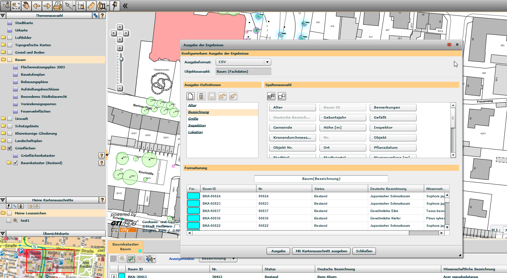

# Baumkataster Heilbronn

Some statistics on a subset of vegetation database of city Heilbronn.

This subset consists information about trees in Allee, 74072 Heilbronn.

## Data Source

The data is generated via the export function of [Geodataportal Heilbronn](https://www.gisserver.de/heilbronn/).

## License

MIT
