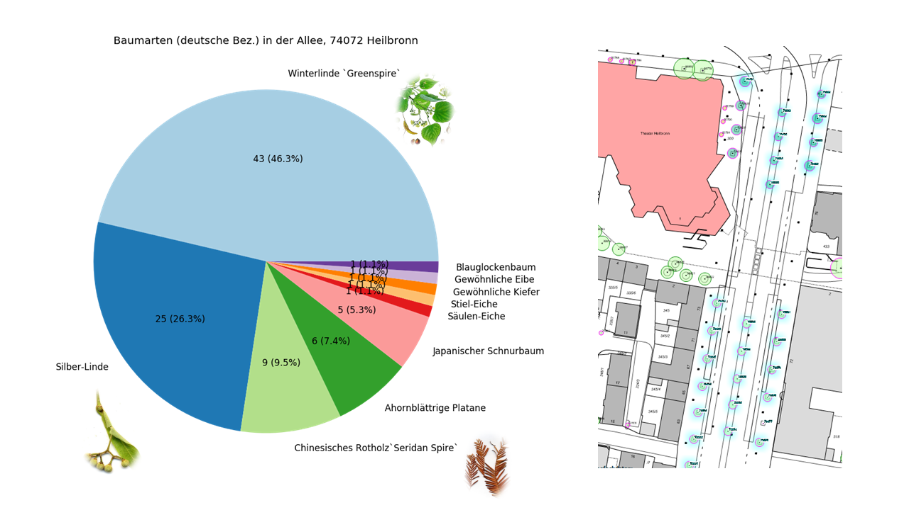
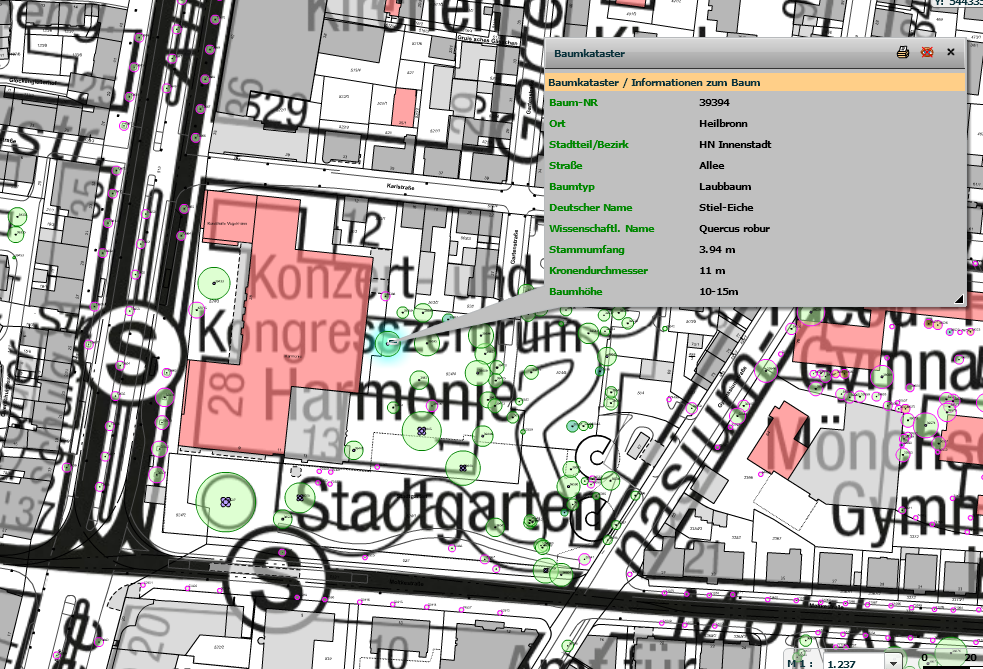

# Baumkataster Heilbronn

Some statistics on a subset of vegetation database of city Heilbronn.

This subset consists information about trees in Allee, 74072 Heilbronn.

## Insights

The oldest (1847) tree in Allee is a Stiel-Eiche:

## Data Source

The data is generated via the export function of [Geodataportal Heilbronn](https://www.gisserver.de/heilbronn/).

## License

MIT
